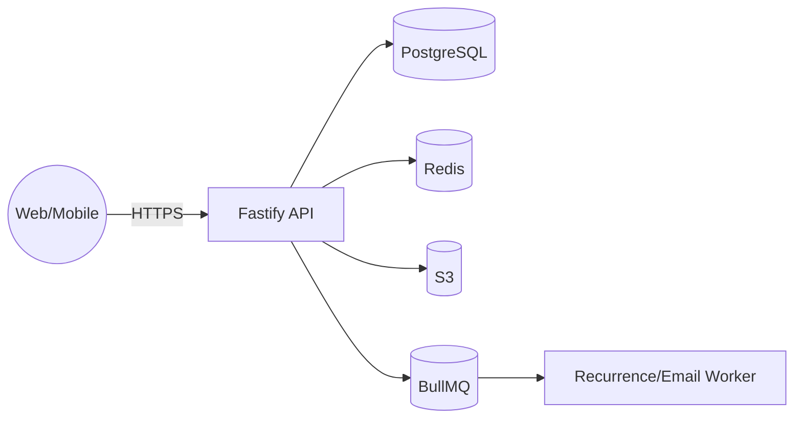

## 1. 시스템 개요 (3C 관점)

- **Context**: 사용자(웹·모바일) ↔ API ↔ DB/스토리지/작업큐
- **Container**: Web(Next.js) / API(Fastify/Node) / DB(PostgreSQL) / Cache(Redis) / Object Storage(S3) / Worker(BullMQ)
- **Component**: Timeline Service, Recurrence Engine, Share Service, Auth/ACL, Analytics Collector

## Web Container (Next.js Frontend)

**기술 스택**: Next.js 15.4.6 + shadcn/ui + tweakcn + Tailwind CSS

**주요 기능**:
- 캘린더 뷰 (월/주 전환)
- 프로젝트 관리 인터페이스
- 사용자 인증 및 권한 관리
- 반응형 모바일 우선 디자인

**성능 목표**:
- 월/주 뷰 전환: < 150ms
- 드래그-드롭 피드백: < 50ms
- 초기 로딩: < 1초

**접근성**: WCAG 2.2 AA 준수

**컴포넌트 아키텍처**:
- shadcn/ui 기반 재사용 가능한 컴포넌트
- tweakcn을 통한 프로젝트별 테마 시스템
- Tailwind CSS 최적화된 스타일링
