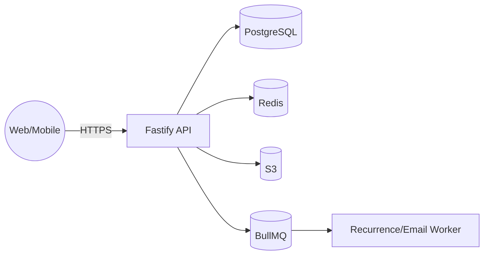

---
# 바로캘린더 아키텍처 문서 – 수정본 v1.2 (MVP)
작성일: 2025-08-11 · 작성자: Bmad FST – Architect Winston · 상태: Draft

> 참고: 이 문서는 섹션별 파일로 분리되었습니다. 최신 목차는 [docs/architecture/README.md](./architecture/README.md)를 확인하세요.

---

## 0. 변경 로그
- v1.2: **필수 개선 7항 반영**
  - 테넌시 대비 `tenant_id` 전 테이블 도입
  - 태그 모델 **정규화(event_tags)** 확정·인덱스 명시
  - Occurrence 전개 운영 파라미터(윈도우/동시성/백오프/SLO) 표로 고정
  - API 버전·오류코드·멱등성·캐시·429 정책 명시
  - 공유 링크 `token_hash`/레이트리밋/로그 보관 정책 명시
  - 관측성 수치(로깅 보존/트레이싱 샘플링/알람)·RPO/RTO 추가
  - 개인정보/보안 최소선(DSR 흐름, IP 축약, 보존기간) 추가
- v1.1: `[cite_start]` 마커 제거, 타임라인 핵심 설계(occurrence/인덱스), API/캐시/SLO, ACL/공유링크, 관측성·테스트·릴리스, 파일 업로드 파이프라인.

---

## 1. 시스템 개요 (3C 관점)
- **Context**: 사용자(웹·모바일) ↔ API ↔ DB/스토리지/작업큐
- **Container**: Web(Next.js) / API(Fastify/Node) / DB(PostgreSQL) / Cache(Redis) / Object Storage(S3) / Worker(BullMQ)
- **Component**: Timeline Service, Recurrence Engine, Share Service, Auth/ACL, Analytics Collector

---

## 2. 데이터 원칙 & 시간 규칙
- **Source of Truth**: PostgreSQL
- **시간 저장**: UTC, 표시/입력은 로컬(기본 Asia/Seoul)
- **표준**: ISO-8601, RFC 5545(RRULE)
- **주 시작**: 월요일(캘린더 규칙은 PRD 준거)

---

## 3. 데이터 모델
### 3.1 핵심 테이블(테넌시 포함)
- `tenants(id, name, created_at, ...)`
- `projects(id, tenant_id, owner_id, name, color, created_at, ...)`
- `members(project_id, user_id, role)`  // Owner/Editor/Commenter/Viewer
- `events(id, tenant_id, project_id, title, starts_at_utc, ends_at_utc, timezone, is_all_day, rrule_json, exdates_json, created_by, created_at, updated_at)`
- `event_occurrences(id, tenant_id, event_id, start_utc, end_utc, window_from_utc, window_to_utc, generated_at)`
- `event_tags(event_id, tag)`
- `share_links(id, tenant_id, scope, project_id, event_id, permission, token_hash, expires_at, revoked_at, created_by, created_at)`
- `comments(id, tenant_id, entity_type, entity_id, author_id, body, created_at)`

### 3.2 인덱스
- `events`: `(tenant_id, project_id, starts_at_utc)`, `(tenant_id, project_id, ends_at_utc)`
- `event_occurrences`: `(tenant_id, project_id, start_utc)`, `GIST tsrange(start_utc, end_utc)`
- `event_tags`: `(tag)`, `(event_id)`
- `share_links`: `(tenant_id, project_id, expires_at)`

---

## 4. 반복 일정 전개(Occurrence)
| 항목 | 값 |
|---|---|
| 저장 | `events.rrule_json`(RRULE/COUNT/UNTIL/EXDATE) |
| 전개 | 조회 윈도우 **±90일** materialize |
| 동시성 | BullMQ **4** |
| 재시도/백오프 | 최대 **5회**, 지수(1s→2s→4s→…) |
| 재전개 트리거 | 이벤트 CRUD, TZ 변경, 윈도우 만료 |
| 목표 p95 | **1k occurrence 당 ≤ 400ms** |
| 데이터 무결성 | soft delete 후 재생성(re-gen) |
| 프리페치 | 클라이언트 requestIdleCallback + 서버 캐시 |

---

## 5. API
- **버전**: 모든 엔드포인트는 **`/v1`**. 차기 변경은 `/v2` 도입 및 `Sunset` 헤더 예고.
- **주요 엔드포인트**
  - `GET /v1/timeline?from&to&projects[]=…&assignees[]=…&tags=…` (기간 겹침: `end>from && start<to`) — `tags`는 정규화된 `event_tags(tag)`를 기준으로 필터링
  - `POST /v1/events` · `PATCH /v1/events/:id` · `DELETE /v1/events/:id`
  - `POST /v1/share-links` · `DELETE /v1/share-links/:id`
  - `GET /v1/projects/:id/members` · `POST /v1/projects/:id/members`
- **멱등성**: `POST`에 **Idempotency-Key** 헤더(24h) – 키+경로+사용자 기준으로 최초 응답 재사용.
- **캐시/ETag**: GET 60s(사소 변경), 조건부 요청(If-None-Match).
- **레이트리밋**: 읽기 120 rpm/유저, 쓰기 30 rpm/유저, 공유 링크 열람 60 rpm/토큰.
- **오류코드**: 400/401/403/404/409/410/422/429/500(표준 JSON 에러 바디: `code/message/details`).

---

## 6. 권한·보안
- **ACL 미들웨어**: 토큰→유저→멤버 역할 확인, 엔드포인트 가드 공통화.
- **공유 링크**: 읽기 전용, `token_hash` 비교, 만료/폐기 확인, 접근 로그 적재(30일).
- **입력 검증**: zod/valibot 스키마, 길이/범위/포맷 검증.
- **보안 기본**: HTTPS/HSTS, CSP, XSS/SQLi 무해화, CSRF(쿠키 사용 시), CORS(화이트리스트).

---

## 7. 파일 업로드 파이프라인
- **제한**: 5MB/파일, jpg/png/webp/svg 화이트리스트
- **흐름**: 프리사인드 URL → S3 업로드 → 메타 저장(URL, 해시, w×h)
- **보안/성능**: EXIF 제거, 썸네일 webp 변환(워커)

---

## 8. 성능·캐시·스케일
- 프런트: 가상 스크롤, Web Worker 전개 계산, 스켈레톤·프리페치
- 백엔드: Fastify+pino, Redis 짧은 TTL 캐시, 인덱스 준수, N+1 회피, 태그 검색 p95 < 100ms(`event_tags(tag)` 인덱스)
- 배포: 모놀리스 시작 → `/timeline`, `/events` 우선 수평 확장

---

## 9. 관측성(Observability) & 품질
- **로그**: 요청 ID 필수, 보존 **14일**(PII 최소화)
- **트레이싱**: OpenTelemetry 샘플링 **10%**(핵심 경로 우선)
- **메트릭**: p95 API/전개지연/에러율/링크 열람수
- **알람**: SLO 위반·워커 실패율 임계치 설정, On-call 채널 연동
- **테스트**: 단위·통합·E2E(Playwright: 월↔주 전환, DnD, 공유 링크)

---

## 10. 보안·개인정보
- **암호**: Argon2/BCrypt 해시, JWT 만료/갱신
- **PII 최소화**: 접근 로그 IP는 **/24 대역**으로 축약 저장
- **보존**: 공유 접근 로그 **30일**, 이벤트 로그 **90일**
- **DSR**: 사용자 삭제요청 시 관련 데이터 소프트딜리트→30일 후 영구 삭제
- **암호화**: DB/백업 암호화(at-rest), TLS in-transit

---

## 11. 백업·복구·운영
- **RPO/RTO**: RPO **24h** / RTO **4h**
- DB 일일 스냅샷, S3 버전닝, 주간 복구 리허설
- 마이그레이션: 버전드 스크립트, Backward compatible → 클린업

---

## 12. 오픈 이슈
- 태그 검색 고급화(접두사/전체어) 인덱싱 전략
- 멀티테넌시 실제 전환 전략(서브도메인·헤더 기반 라우팅)

---
