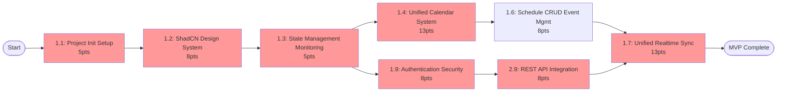

# Story Dependency Matrix - Baro Calendar

**Last Updated**: 2025-01-09  
**Maintained By**: Bob (Scrum Master)  
**Critical Path Identified**: Yes  
**Backend Compatibility**: ✅ Verified (Events API Implemented)

---

## 🎯 Critical Path Analysis

### Primary Critical Path (P0 Stories) - Updated Numbering


**Critical Path Duration**: 68 Story Points (≈5 Sprints)

---

## 📊 Dependency Matrix Table

| Story | Depends On | Blocks | Priority | Points | Can Start Sprint |
|-------|------------|---------|----------|--------|------------------|
| **1.1** | None | 1.2, 1.3, 1.9, All UI | P0 | 5 | Sprint 1 |
| **1.2** | 1.1 | 1.4, 1.6, 2.1, 2.2, 2.4 | P0 | 8 | Sprint 1 |
| **1.3** | 1.1 | 1.4, 1.5, Project Features | P0 | 5 | Sprint 2 |
| **1.4** | 1.2, 1.3, ✅Events API | 1.6, 1.8, 2.1 | P0 | 13 | Sprint 3 |
| **1.5** | 1.3, ✅Projects API | Project Features | P1 | 8 | Sprint 4 |
| **1.6** | 1.4, ✅Events CRUD | 1.8, 2.23 | P1 | 8 | Sprint 4 |
| **1.7** | 1.1, 2.9 | Real-time Features | P0 | 13 | Sprint 6 |
| **1.8** | 1.6, 1.4 | 2.23 | P2 | 13 | Sprint 7 |
| **1.9** | 1.1 | 2.8, 2.9, Security Features | P0 | 8 | Sprint 5 |
| **1.10** | 1.2 | UI Theming | P1 | 5 | Sprint 2 |

### Epic 2 Dependencies

| Story | Depends On | Blocks | Priority | Points | Can Start Sprint |
|-------|------------|---------|----------|--------|------------------|
| **2.2** | 1.2, 1.4, ✅Events API | Event Features | P0 | 5 | Sprint 5 |
| **2.3** | Merged with 1.5 | - | - | - | - |
| **2.4** | 1.2 | 2.22 | P1 | 8 | Sprint 6 |
| **2.5** | 2.1-2.4 | Performance Features | P1 | 5 | Sprint 7 |
| **2.6** | All UI | - | P1 | 3 | Sprint 8 |
| **2.7** | Core Features | - | P1 | 5 | Sprint 8 |
| **2.8** | All Features | - | P1 | 3 | Sprint 9 |
| **2.9** | 1.1a | 2.21 | P2 | 5 | Sprint 9 |
| **2.10** | 1.7 | - | P1 | 3 | Sprint 6 |
| **2.11** | 1.1c, 1.7 | 1.5, API Features | P0 | 8 | Sprint 5 | ✅REST API |
| **2.12** | 1.1c | - | P2 | 3 | Sprint 9 |
| **2.19** | Merged with 1.5 | - | - | - | - |
| **2.22** | 2.4 | - | P2 | 8 | Sprint 10 |
| **2.23** | 1.6 | - | P2 | 5 | Sprint 8 |
| **2.24** | 1.4 | - | P2 | 5 | Sprint 10 |
| **2.26** | 2.20 | - | P2 | 8 | Sprint 10 |

---

## 🔗 Dependency Chains

### Chain 1: Core Infrastructure
```
1.1a → 1.1b → 1.1c → [All Features]
```

### Chain 2: Calendar Features
```
1.1c → 1.2 → 1.4 → 1.5 (Realtime)
         ↓      ↓
        2.4    1.6 (Recurring)
         ↓      ↓
        2.22   2.23
```

### Chain 3: Authentication & API
```
1.1a → 1.7 → 2.11 → 1.5 (Realtime)
         ↓      ↓
        2.10   API Features
```

### Chain 4: Project Management
```
1.1c → 1.3 → 1.4 → Project Features
```

---

## 🚨 Blocking Dependencies

### Critical Blockers (Must Complete First)
1. **1.1a** - Blocks everything
2. **1.1b** - Blocks all UI development
3. **1.1c** - Blocks state management features
4. **1.2** - Blocks calendar-related features
5. **1.7** - Blocks security and API features

### High Impact Dependencies
- **2.11 (GraphQL)** - Required for 1.5 (Realtime)
- **1.4 (Event CRUD)** - Required for event features
- **1.3 (Project CRUD)** - Required for project features

---

## 📈 Parallel Work Opportunities

### Sprint 1-2: Foundation
- Team A: 1.1a → 1.1b
- Team B: (Wait for 1.1a) → 1.1c

### Sprint 3-4: Core Features
- Team A: 1.2 (Calendar)
- Team B: 1.8 (Design System)

### Sprint 4-5: Management Systems
- Team A: 1.3 (Projects)
- Team B: 1.4 (Events)
- Team C: 1.7 (Auth)

### Sprint 5-6: Integration
- Team A: 2.11 (GraphQL)
- Team B: 2.2 (Event Management)
- Team C: 2.10 (Security)

### Sprint 6-7: Advanced Features
- Team A: 1.5 (Realtime - after 2.11)
- Team B: 2.4 (Mobile PWA)
- Team C: 1.6 (Recurring)

---

## ⚠️ Risk Areas

### High Risk Dependencies
1. **1.5 (Realtime)** - Depends on 3 critical stories
2. **1.6 (Recurring)** - Complex, depends on calendar core
3. **2.11 (GraphQL)** - Blocks realtime features

### Mitigation Strategies
1. **Start 1.7 and 2.11 early** - They block realtime
2. **Prototype 1.5 early** - Identify technical challenges
3. **Stub APIs for 2.11** - Allow parallel development

---

## 📋 Sprint Loading (Based on Dependencies)

### Sprint 1 (13 points)
- 1.1a: Project Init (5)
- 1.1b: ShadCN UI - Start (8)

### Sprint 2 (10 points)
- 1.1b: ShadCN UI - Complete
- 1.1c: State Management (5)
- 1.8: Design System (5)

### Sprint 3 (13 points)
- 1.2: Calendar System (13)

### Sprint 4 (16 points)
- 1.3: Project CRUD (8)
- 1.4: Event CRUD (8)

### Sprint 5 (21 points)
- 1.7: Auth System (8)
- 2.11: GraphQL (8)
- 2.2: Event Management (5)

### Sprint 6 (14 points)
- Start 1.5: Realtime (13) - Partial
- 2.10: Security (3)

### Sprint 7 (16 points)
- Complete 1.5: Realtime
- 2.4: Mobile PWA (8)
- 2.5: Performance (5)

### Sprint 8 (21 points)
- 1.6: Recurring (13)
- 2.6: Accessibility (3)
- 2.23: Recurring UI (5)

### Sprint 9 (16 points)
- 2.7: Testing (5)
- 2.8: Error Handling (3)
- 2.9: CI/CD (5)
- 2.12: Monitoring (3)

### Sprint 10 (21 points)
- 2.22: Offline PWA (8)
- 2.24: File Attachments (5)
- 2.26: Dev Checklist (8)

---

## 🎯 Recommendations

### Immediate Actions
1. ✅ Validate dependencies with tech leads
2. ✅ Confirm 1.1a can start immediately
3. ✅ Assign teams to parallel tracks

### Resource Allocation
- **Critical Path Team**: Focus on 1.1a → 1.1c → 1.2 → 1.5
- **Auth/API Team**: 1.7 → 2.11 (parallel track)
- **UI/UX Team**: 1.1b → 1.8 → UI features

### Watch Points
- Sprint 5-6: Heavy load, consider splitting
- 1.5 (Realtime): High complexity, allocate senior devs
- 1.6 (Recurring): Consider MVP version first

---

**Document Status**: Living document, update after each sprint planning  
**Next Review**: Sprint 1 Planning Session  
**Owner**: Scrum Master Team