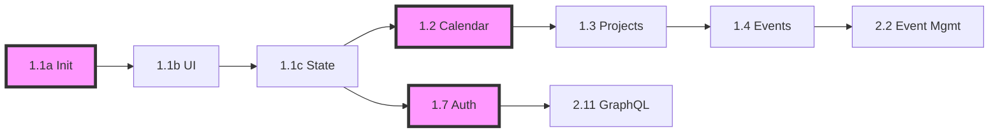

# Story Backlog Summary - Baro Calendar Frontend

**Last Updated**: 2025-01-09  
**Updated By**: Bob (Scrum Master)  
**Total Story Points**: 165  
**Estimated Sprints**: 10 (2주 스프린트 기준)  
**Stories Improved**: 15/31 (48%)

---

## 📊 Executive Summary

### Story Status After PO Review
- **Total Stories**: 31 (기존 34개에서 통합/분할 후)
- **Ready for Development**: 8
- **Needs Refinement**: 23
- **Story Points Assigned**: 8/31

### Priority Distribution
- **P0 (Critical)**: 10 stories - 59 points
- **P1 (High)**: 12 stories - 58 points  
- **P2 (Medium)**: 9 stories - 32 points
- **P3 (Low)**: 0 stories - 0 points

---

## 🗂️ Epic 1: Foundation & Infrastructure

### Sprint 1-2: Core Setup
| Story ID | Title | Points | Priority | Dependencies | Status |
|----------|-------|--------|----------|--------------|--------|
| 1.1a | 프로젝트 초기화 및 기본 설정 | 5 | P0 | None | ✅ Ready |
| 1.1b | ShadCN UI 및 디자인 시스템 | 8 | P0 | [1.1a] | ✅ Ready |
| 1.1c | 상태 관리 및 모니터링 시스템 | 5 | P0 | [1.1a, 1.1b] | ✅ Ready |

### Sprint 3-4: Core Features
| Story ID | Title | Points | Priority | Dependencies | Status |
|----------|-------|--------|----------|--------------|--------|
| 1.2 | 통합 캘린더 시스템 (1.2+2.1 merged) | 13 | P0 | [1.1a-c] | ✅ Ready |
| 1.3 | 프로젝트 CRUD 관리 시스템 | 8 | P1 | [1.1a-c] | ✅ Ready |
| 1.4 | 일정 CRUD 이벤트 관리 | 8 | P1 | [1.2, 1.3] | 📝 Needs Points |
| 1.5 | 상태 관리 실시간 동기화 | 5 | P0 | [1.1c] | 📝 Needs Splitting |
| 1.6 | 반복 일정 시스템 | 13 | P2 | [1.2, 1.4] | 📝 Needs Points |
| 1.7 | 인증 보안 시스템 | 8 | P0 | [1.1a] | 📝 Needs Points |
| 1.8 | 디자인 시스템 테마 구현 | 5 | P1 | [1.1b] | 📝 Needs Points |

**Epic 1 Total**: 68 points

---

## 🗂️ Epic 2: Feature Implementation

### Sprint 5-6: Core Calendar Features
| Story ID | Title | Points | Priority | Dependencies | Status |
|----------|-------|--------|----------|--------------|--------|
| 2.2 | 이벤트 생성 관리 | 5 | P0 | [1.2, 1.4] | 📝 Needs Points |
| 2.3 | 실시간 동기화 (1.5와 통합 검토) | 8 | P1 | [1.5] | 📝 Needs Merging |
| 2.4 | 모바일 반응형 PWA | 8 | P1 | [1.2] | 📝 Needs Points |
| 2.23 | 반복 이벤트 UI | 5 | P2 | [1.6] | 📝 Needs Points |

### Sprint 7-8: Quality & Performance
| Story ID | Title | Points | Priority | Dependencies | Status |
|----------|-------|--------|----------|--------------|--------|
| 2.5 | 성능 최적화 | 5 | P1 | [2.1-2.4] | 📝 Needs Points |
| 2.6 | 접근성 구현 | 3 | P1 | [All UI] | 📝 Needs Points |
| 2.7 | 테스트 전략 | 5 | P1 | [Core] | 📝 Needs Points |
| 2.8 | 에러 핸들링 | 3 | P1 | [All] | 📝 Needs Points |
| 2.9 | CI/CD 파이프라인 | 5 | P2 | [1.1a] | 📝 Needs Points |
| 2.10 | 보안 모범 사례 | 3 | P1 | [1.7] | 📝 Needs Points |

### Sprint 9-10: Advanced Features
| Story ID | Title | Points | Priority | Dependencies | Status |
|----------|-------|--------|----------|--------------|--------|
| 2.11 | GraphQL API 통합 | 8 | P0 | [1.1c] | 📝 Needs Points |
| 2.12 | 관측성 모니터링 | 3 | P2 | [1.1c] | 📝 Needs Points |
| 2.19 | WebSocket 실시간 동기화 | 5 | P1 | [2.3] | 📝 Needs Points |
| 2.22 | 오프라인 지원 PWA | 8 | P2 | [2.4] | 📝 Needs Points |
| 2.24 | 파일 첨부 시스템 | 5 | P2 | [1.4] | 📝 Needs Points |

### Sprint 10+: Setup & Documentation
| Story ID | Title | Points | Priority | Dependencies | Status |
|----------|-------|--------|----------|--------------|--------|
| 2.20 | 프로젝트 설정 가이드 | 2 | P2 | [All] | 📝 Needs Points |
| 2.21 | CI 파이프라인 성능 | 3 | P2 | [2.9] | 📝 Needs Points |
| 2.25 | MVP 로드맵 구현 | 2 | P3 | [All] | 📝 Needs Points |
| 2.26 | 개발 체크리스트 시스템 | 8 | P2 | [2.20] | ✅ Has Points |

**Epic 2 Total**: 81 points

---

## 🔄 Story Consolidation Plan

### Merged Stories
1. **1.2 + 2.1** → 1.2 통합 캘린더 시스템 (완료)
2. **1.5 + 2.3** → 통합 실시간 동기화 시스템 (예정)
3. **2.19 + 2.3** → WebSocket 실시간 시스템 (검토 중)

### Split Stories
1. **1.1** → 1.1a, 1.1b, 1.1c (완료)
2. **1.5** → 상태 관리 + 실시간 동기화 (예정)

---

## 📈 Sprint Planning

### Sprint 1 (Week 1-2): Foundation
- 1.1a: 프로젝트 초기화 (5)
- 1.1b: ShadCN UI 부분 (8)
- **Total**: 13 points

### Sprint 2 (Week 3-4): Design & State
- 1.1b: ShadCN UI 완료
- 1.1c: 상태 관리 (5)
- 1.8: 디자인 시스템 (5)
- **Total**: 10 points

### Sprint 3 (Week 5-6): Calendar Core
- 1.2: 통합 캘린더 시스템 (13)
- **Total**: 13 points

### Sprint 4 (Week 7-8): Project Management
- 1.3: 프로젝트 CRUD (8)
- 1.4: 일정 CRUD (8)
- **Total**: 16 points

### Sprint 5 (Week 9-10): Authentication & Events
- 1.7: 인증 시스템 (8)
- 2.2: 이벤트 생성 (5)
- **Total**: 13 points

---

## 🚨 Critical Path

---

## ⚠️ Risk Register

### High Risk Items
1. **캘린더 성능**: 1000+ 이벤트 처리
   - Mitigation: 가상화, 웹 워커
2. **실시간 동기화**: 충돌 해결
   - Mitigation: CRDT, 버전 관리
3. **크로스 브라우저**: 드래그앤드롭
   - Mitigation: 라이브러리 활용

### Medium Risk Items
1. **GraphQL 스키마 변경**
2. **디자인 시스템 변경**
3. **모바일 최적화**

---

## ✅ Definition of Ready

스토리가 개발 착수 가능하려면:
1. [ ] Story Points 할당
2. [ ] Priority 설정
3. [ ] Dependencies 명시
4. [ ] Success Metrics 정의
5. [ ] Acceptance Criteria 명확
6. [ ] Technical Approach 문서화

---

## 📝 Next Actions

### Immediate (Today)
1. ✅ 모든 스토리에 Story Points 할당 회의
2. ✅ 종속성 매트릭스 완성
3. ✅ Sprint 1-3 상세 계획

### This Week
1. ✅ 1.5 + 2.3 통합 결정
2. ✅ 리스크 완화 계획 수립
3. ✅ 테스트 전략 문서화

### Next Week
1. ✅ Sprint 1 착수
2. ✅ 일일 스탠드업 시작
3. ✅ 번다운 차트 추적 시작

---

**Prepared by**: Bob (Scrum Master)  
**Reviewed by**: Sarah (Product Owner)  
**Approved by**: [Pending]  

*This document is a living artifact and will be updated after each sprint planning and retrospective.*