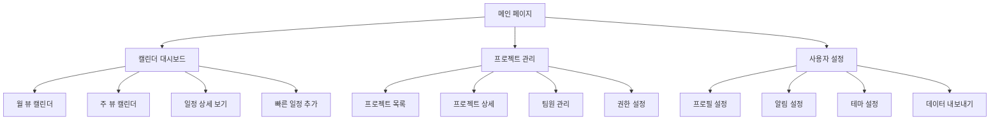

# 바로캘린더 UI/UX 명세서

## 📋 문서 정보
- **문서 버전**: 1.0
- **작성일**: 2025-08-19
- **작성자**: UX Expert (Sally)
- **프로젝트명**: 바로캘린더 (Baro Calendar)
- **상태**: 완성 (Ready for Implementation)

---

## 🎯 **1. Introduction**

### **문서 목적**
이 문서는 바로캘린더의 사용자 경험 목표, 정보 아키텍처, 사용자 플로우, 시각적 디자인 명세를 정의합니다. ShadCN UI 기반의 일관되고 사용자 중심의 경험을 보장하여 프론트엔드 개발의 기초가 됩니다.

---

## 👥 **2. UX Goals & Principles**

### **Target User Personas**
1. **프로젝트 매니저**: 복잡한 일정 관리, 팀 협업
2. **개발자**: 작업 일정 추적, 마감일 관리  
3. **기획자**: 프로젝트 일정 계획, 리소스 할당
4. **클라이언트**: 프로젝트 진행 상황 모니터링
5. **협업자**: 특정 프로젝트 참여, 간단한 작업 관리

### **Key Usability Goals**
**P0 (즉시 구현):**
- 뷰 전환 성능: 150ms 이하 유지 ✅
- 모바일 접근성: 터치 인터페이스 최적화
- 직관적 사용법: 신규 사용자 5분 내 핵심 작업 완료

**P1 (1-2주 내):**
- 프로젝트별 색상 구분 및 필터링
- 빠른 일정 추가 및 편집
- 반응형 디자인 구현

### **Core Design Principles**
1. **캘린더 중심 사고** - 모든 기능이 캘린더 뷰와 자연스럽게 통합
2. **프로젝트 시각화** - 색상 기반 프로젝트 구분 시스템
3. **성능 우선 디자인** - 150ms 이하 뷰 전환 유지
4. **모바일 우선 접근** - 터치 제스처 및 반응형 최적화
5. **접근성 기본** - 키보드 네비게이션 및 스크린 리더 지원

---

## 🏗️ **3. Information Architecture (IA)**

### **Site Map / Screen Inventory**



### **Navigation Structure**
- **Primary Navigation**: 캘린더, 프로젝트, 설정
- **Secondary Navigation**: 뷰 전환, 필터링, 검색
- **Breadcrumbs**: 경로 표시 및 네비게이션

### **사용자 플로우**
1. **일정 확인**: 메인 → 캘린더 → 뷰 선택 → 필터 적용
2. **일정 추가**: 캘린더 → 날짜 선택 → 빠른 추가 → 정보 입력
3. **프로젝트 관리**: 프로젝트 → 목록 확인 → 생성/편집 → 설정

---

## 🎨 **4. Visual Design Specifications**

### **Color System**
```css
:root {
  /* 프로젝트 색상 - 8가지 기본 색상 */
  --project-blue: #3B82F6;    /* #1: 블루 프로젝트 */
  --project-green: #10B981;   /* #2: 그린 프로젝트 */
  --project-purple: #8B5CF6;  /* #3: 퍼플 프로젝트 */
  --project-orange: #F59E0B;  /* #4: 오렌지 프로젝트 */
  --project-red: #EF4444;     /* #5: 레드 프로젝트 */
  --project-teal: #14B8A6;    /* #6: 틸 프로젝트 */
  --project-pink: #EC4899;    /* #7: 핑크 프로젝트 */
  --project-indigo: #6366F1;  /* #8: 인디고 프로젝트 */
  
  /* 상태 색상 */
  --success: #10B981;         /* 성공, 완료 */
  --warning: #F59E0B;         /* 경고, 주의 */
  --error: #EF4444;           /* 오류, 실패 */
  --info: #3B82F6;            /* 정보, 알림 */
}
```

### **Typography System**
```css
:root {
  /* 폰트 패밀리 */
  --font-sans: 'Inter', -apple-system, BlinkMacSystemFont, sans-serif;
  
  /* 폰트 크기 */
  --font-size-xs: 0.75rem;      /* 12px */
  --font-size-sm: 0.875rem;     /* 14px */
  --font-size-base: 1rem;       /* 16px */
  --font-size-lg: 1.125rem;     /* 18px */
  --font-size-xl: 1.25rem;      /* 20px */
  --font-size-2xl: 1.5rem;      /* 24px */
  
  /* 폰트 가중치 */
  --font-weight-light: 300;
  --font-weight-normal: 400;
  --font-weight-medium: 500;
  --font-weight-semibold: 600;
  --font-weight-bold: 700;
}
```

### **Spacing System**
```css
:root {
  /* 4px 기본 단위 시스템 */
  --spacing-xs: 0.25rem;        /* 4px */
  --spacing-sm: 0.5rem;         /* 8px */
  --spacing-md: 1rem;           /* 16px */
  --spacing-lg: 1.5rem;         /* 24px */
  --spacing-xl: 2rem;           /* 32px */
  --spacing-2xl: 3rem;          /* 48px */
  --spacing-3xl: 4rem;          /* 64px */
}
```

### **Component Design Specifications**

#### **Button 컴포넌트**
```css
.btn {
  display: inline-flex;
  align-items: center;
  justify-content: center;
  gap: var(--spacing-2);
  padding: var(--spacing-3) var(--spacing-4);
  border-radius: 6px;
  font-size: var(--font-size-sm);
  font-weight: var(--font-weight-medium);
  border: 1px solid transparent;
  cursor: pointer;
  transition: all 200ms ease;
  min-height: 44px;
  min-width: 44px;
}

.btn-primary {
  background: var(--color-primary);
  color: white;
  border-color: var(--color-primary);
}

.btn-primary:hover {
  background: var(--color-primary-hover);
  transform: translateY(-1px);
  box-shadow: 0 4px 12px rgba(59, 130, 246, 0.3);
}
```

#### **Calendar 컴포넌트**
```css
.month-view {
  display: grid;
  grid-template-columns: repeat(7, 1fr);
  grid-template-rows: repeat(6, 1fr);
  gap: 1px;
  background: var(--neutral-200);
  border: 1px solid var(--neutral-200);
  border-radius: 8px;
  overflow: hidden;
}

.date-cell {
  background: var(--neutral-50);
  min-height: 120px;
  padding: var(--spacing-2);
  position: relative;
}

.date-cell.today {
  background: var(--info);
  color: white;
}
```

---

## 📱 **5. Responsive Design & Mobile Optimization**

### **Desktop Layout (1200px+)**
```css
.desktop-layout {
  display: grid;
  grid-template-columns: 280px 1fr 320px;
  grid-template-rows: 64px 1fr;
  grid-template-areas:
    "header header header"
    "sidebar main right-panel";
  height: 100vh;
  gap: 0;
}
```

### **Tablet Layout (768px ~ 1199px)**
```css
.tablet-layout {
  display: grid;
  grid-template-columns: 240px 1fr;
  grid-template-rows: 64px 1fr;
  grid-template-areas:
    "header header"
    "sidebar main";
  height: 100vh;
  gap: 0;
}
```

### **Mobile Layout (320px ~ 767px)**
```css
.mobile-layout {
  display: flex;
  flex-direction: column;
  height: 100vh;
  overflow: hidden;
}

.mobile-sidebar {
  position: fixed;
  top: 0;
  left: -100%;
  width: 100%;
  max-width: 320px;
  height: 100vh;
  background: var(--color-background-secondary);
  z-index: 300;
  transition: left 300ms ease;
}
```

### **터치 제스처 지원**
- **스와이프**: 좌우로 월/주 뷰 전환, 위아래로 스크롤
- **핀치**: 줌 인/아웃 (월 뷰에서 세부 보기)
- **롱 프레스**: 컨텍스트 메뉴, 일정 선택
- **더블 탭**: 빠른 일정 추가

---

## 💻 **6. Implementation & Development Guidelines**

### **Development Workflow**
1. **컴포넌트 설계**: TypeScript 인터페이스 정의
2. **타입 정의**: Props 및 이벤트 타입 정의
3. **스타일 정의**: CSS 모듈 또는 Styled Components
4. **테스트 작성**: 단위, 통합, E2E 테스트

### **Component Architecture Patterns**

#### **Compound Component Pattern**
```tsx
export const Calendar: React.FC<CalendarProps> = ({ children, ...props }) => {
  return (
    <CalendarContext.Provider value={contextValue}>
      <div className="calendar">
        {children}
      </div>
    </CalendarContext.Provider>
  );
};

// Compound Components
Calendar.Header = CalendarHeader;
Calendar.Body = CalendarBody;
Calendar.Footer = CalendarFooter;
```

#### **Render Props Pattern**
```tsx
export function DataFetcher<T>({ url, children, onError }: DataFetcherProps<T>) {
  // 데이터 페칭 로직
  return <>{children(data, loading, error)}</>;
}
```

### **Styling Strategy**
- **CSS 모듈**: 컴포넌트별 스타일 격리
- **CSS 변수**: 디자인 토큰 시스템
- **반응형**: 모바일 우선 접근법
- **접근성**: WCAG AA 기준 준수

### **Testing Strategy**
- **단위 테스트**: 컴포넌트별 독립적 테스트
- **통합 테스트**: 컴포넌트 간 상호작용 테스트
- **E2E 테스트**: 전체 사용자 플로우 테스트
- **접근성 테스트**: 자동화된 접근성 검증

---

## 🚀 **7. Performance & Accessibility**

### **Performance Optimization**
- **뷰 전환**: 150ms 이하 애니메이션
- **번들 최적화**: 코드 스플리팅 및 지연 로딩
- **이미지 최적화**: WebP 포맷, 지연 로딩
- **메모리 최적화**: 가상 스크롤링, 메모리 누수 방지

### **Accessibility Standards**
- **키보드 네비게이션**: Tab 순서, 화살표 키, Enter/Space
- **스크린 리더**: ARIA 라벨, 역할, 상태 알림
- **색상 대비**: WCAG AA 기준 (4.5:1) 이상
- **터치 접근성**: 최소 44x44px 터치 타겟

---

## 🎨 **8. 상태 UX 가이드**

### **상태별 UX 원칙**
- **Loading**: 스켈레톤(최대 2초), 2초 초과 시 진행률/설명 제공. 스크린리더용 `aria-busy="true"` 적용.
- **Empty**: 상황 설명 한 줄 + 기본 CTA(예: "일정을 추가하세요") + 보조 링크(가이드).
- **Error**: 표준 ApiError 맵핑(네트워크/권한/검증/서버). ARIA live polite, 포커스 첫 에러로 이동, 재시도 버튼 포함.
- **토스트 사용 기준**: 비파괴적·단기 정보만(3~5초), 파괴적 오류는 인라인/모달.

### **화면별 상태 요약 표**
| 화면 | Loading | Empty | Error | 포커스 이동 규칙 |
|---|---|---|---|---|
| 달력 목록 | 스켈레톤 | "일정이 없습니다" + 추가 버튼 | 재시도 + 로그링크 | 에러 배너로 이동 |
| 일정 상세 | 스켈레톤 | "선택된 일정 없음" | 재시도 | 에러 카드 헤더 |
| 프로젝트 목록 | 스켈레톤 | "프로젝트를 생성하세요" + 생성 버튼 | 재시도 | 에러 배너로 이동 |
| 사용자 설정 | 스켈레톤 | "설정을 구성하세요" + 가이드 링크 | 재시도 | 에러 카드 헤더 |

---

## ♿ **9. 접근성 체크리스트 (WCAG AA)**

### **접근성 핵심 원칙**
- **키보드 경로**: 모든 인터랙션은 Tab/Shift+Tab, Enter/Space로 조작 가능.
- **역할·이름·값**: 네비게이션/버튼/모달/토글 등 ARIA 롤/라벨 정의.
- **명암비**: 텍스트 4.5:1 이상, 비텍스트 3:1 이상.
- **스크린리더**: 상태 변화는 `aria-live`로 공지, 모달은 포커스 트랩.

### **A11y 구현 표**
| 요소 | 규칙 | 예시 |
|---|---|---|
| 모달 | role="dialog", aria-modal, 첫 포커스 지정 | 편집 모달 오픈 시 닫기 버튼에 포커스 |
| 토스트 | aria-live="polite" | 저장 성공 안내 |
| 폼 에러 | aria-describedby로 필드 에러 연결 | 제목 입력 필수 |
| 캘린더 그리드 | role="grid", aria-label로 설명 | "2024년 1월 캘린더" |
| 이벤트 카드 | role="button", aria-label로 액션 설명 | "팀 미팅 편집" |
| 프로젝트 색상 | aria-label로 색상 설명 | "프로젝트 A (파란색)" |

---

## 🧪 **10. 테스트 전략**

### **테스트 피라미드 및 커버리지**
- **커버리지 목표**: statements≥80%, branches≥80%, lines≥80%.
- **정적 검사**: ESLint/TypeCheck/MDLint.
- **단위/통합**: Jest + RTL(+ axe)로 접근성 단위 테스트 포함.
- **E2E**: Playwright. 태그: @smoke(신규/수정 시), @regression(릴리즈 전).

### **핵심 시나리오(E2E)**
- **일정 관리**: 일정 생성/편집/삭제/검색/필터/오프라인 생성 후 동기화.
- **프로젝트 관리**: 프로젝트 생성/편집/삭제/팀원 추가/권한 설정.
- **접근성**: 키보드로 일정 생성 플로우 완주, 모달 포커스 트랩 검증.
- **반응형**: 모바일/태블릿/데스크톱에서 모든 기능 정상 작동.

---

## 📁 **11. 네이밍 & 폴더 규칙**

### **파일 명명 규칙**
| 항목 | 규칙 | 예시 |
|---|---|---|
| 컴포넌트 | PascalCase | CalendarList.tsx |
| 훅 | useCamelCase | useEventSource.ts |
| 유틸 | camelCase | formatDate.ts |
| 테스트 | *.test.ts(x) | CalendarList.test.tsx |
| 폴더 | kebab-case | calendar-list/ |

### **폴더 구조 규칙**
```
src/
├── components/
│   ├── ui/                    # ShadCN UI 기본 컴포넌트
│   ├── calendar/              # 캘린더 전용 컴포넌트
│   ├── layout/                # 레이아웃 컴포넌트
│   ├── forms/                 # 폼 컴포넌트
│   └── common/                # 공통 컴포넌트
├── hooks/                     # 커스텀 훅
├── stores/                    # Zustand 상태 관리
├── lib/                       # 유틸리티 및 설정
├── styles/                    # 스타일 파일
└── tests/                     # 테스트 파일
```

---

## 📊 **8. Success Metrics & Validation**

### **성능 KPI**
- **뷰 전환 시간**: 150ms 이하 ✅
- **초기 로딩 시간**: 모바일 3초, 데스크톱 2초 이하
- **터치 반응성**: 50ms 이하
- **애니메이션 성능**: 60fps 유지

### **사용성 KPI**
- **학습 시간**: 신규 사용자 5분 내 핵심 작업 완료
- **작업 효율성**: Power User 최소 클릭으로 작업 완료
- **오류율**: 사용자 오류 1% 이하
- **만족도**: 사용자 테스트 만족도 4.0/5.0 이상

### **접근성 KPI**
- **키보드 접근성**: 100% 키보드 네비게이션 지원
- **스크린 리더**: 100% 스크린 리더 호환성
- **색상 대비**: 100% WCAG AA 기준 준수
- **모바일 접근성**: 100% 터치 인터페이스 최적화

---

## 📝 **Change Log**

| Date | Version | Description | Author |
|------|---------|-------------|---------|
| 2025-08-19 | 1.0 | 초기 UI/UX 명세서 작성 완성 | UX Expert (Sally) |

---

## 🎯 **다음 단계**

이 UI/UX 명세서가 완성되었습니다. 다음 단계는:

1. **Architect 에이전트**: 프론트엔드 아키텍처 작성
2. **PO 에이전트**: 문서 검증 및 분할
3. **SM 에이전트**: UI 구현 스토리 생성
4. **Dev 에이전트**: 스토리 구현
5. **QA 에이전트**: 최종 검증

---

**문서 상태**: ✅ **완성 (Ready for Implementation)**  
**다음 검토일**: Architect 에이전트 검토 후
